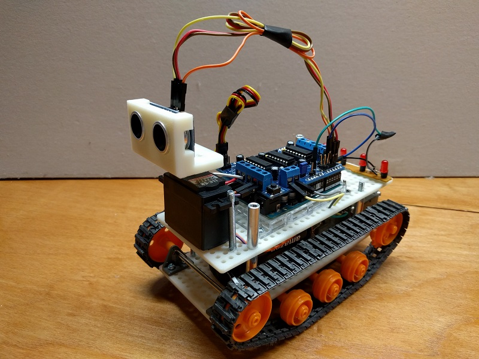

# Arduino Obstacle Avoiding Robot

This project is my first attempt at creating an obstacle avoidance robot.  I had three goals for this project:
1. Use a state machine and the function millis() instead of delay()
1. Use tank treads instead of wheels.  
1. Introduce electronics and programming to my kids. 

## Getting Started

Here is the list of materials used for the project.  

### Parts List

* (1x) [Arduino Uno R3](https://www.amazon.com/Arduino-Uno-R3-Microcontroller-A000066/dp/B008GRTSV6/ref=sr_1_3?ie=UTF8&qid=1504949502&sr=8-3&keywords=arduino+uno+r3)
* (1x) [SainSmart L293D Motor Drive Shield](https://www.amazon.com/SainSmart-L293D-Shield-Arduino-Duemilanove/dp/B00813HBBO)
* (1x) [HC-SR04 Ranging Detector](https://www.amazon.com/SainSmart-HC-SR04-Ranging-Detector-Distance/dp/B004U8TOE6/ref=sr_1_7?s=electronics&ie=UTF8&qid=1504950123&sr=1-7&keywords=HC-SR04)
* (1x) [HS-311 Servo](https://www.amazon.com/Hitec-31311S-HS-311-Standard-Universal/dp/B0006O3WVE/ref=sr_1_1?s=toys-and-games&ie=UTF8&qid=1504950214&sr=1-1&keywords=HS-311)
* (2x) [6V DC Motor](https://www.pololu.com/product/1117)
* (2x) [Ceramic Capacitor 0.1uF 50V](https://www.pololu.com/product/2451)
* (1x) [Tamiya 70168 Double Gearbox Kit](https://www.pololu.com/product/114)
* (1x) [Tamiya 70100 Track and Wheel Set](https://www.pololu.com/product/106)
* (2x) [Tamiya compatible building plate](https://www.thingiverse.com/thing:1433735)
* (6x) AA Batteries
* (1x) [6 x AA Battery Holder](https://www.amazon.com/Hilitchi-Thicken-Battery-Standard-Connector/dp/B019P0VDRO/ref=pd_sim_23_18?_encoding=UTF8&psc=1&refRID=YE1578B2RMW98ZS8N293)
* (1x) [Toggle Switch](https://www.pololu.com/product/1407)
* (1x) 9v Battery clip with bare leads (used to connect battery pack)
* (1x) LED Light bar from old toy
* (4x) Spacers from the hardware store (used to seperate build plates)
* Wire

## Development
There are a lot of tutorials on the internet that list step-by-step instructions for building and coding an obstacle avoidance robot.  The code, pictures, and parts list should be a good reference as to how I built the robot.  I wanted to document some of the design decisions and issues that I ran into along the way.

### Design
* The tutorial, [Building an Arduino Robot](https://blog.miguelgrinberg.com/post/building-an-arduino-robot-part-i-hardware-components), was used as a guide in developing this project.  The instructions were very well documented and easy to follow.    
* The Adafruit MotorDriver library was used to control the SainSmart MotorDriver Shield
* Added a library to control [Pololu DRV8835 Dual Motor Driver Shield](https://www.pololu.com/product/2511)
* Added logic to blink the LED light bar
* Used tank tracks so that it can drive over smaller obstacles that are not detected by the Range detector

### Issues & Resolutions
* Use 6 AA batteries to power robot.  A lot of tutorials I read only used a 9V battery, but this did not provide enough voltage.  I also tried 4 AA batteries, but those still did not provide enough voltage.  After reading the spec sheets for the motors and motor shield, I determined I needed to use 6 AA batteries.  This provided enough voltage to power to drive all the motors and blink the lights.  

* Use 6V motors instead of the 3V motors that came with the Double Gear Box kit.  I had issues using the motors that came with the gear box kit.  For example, the motors would drive the robot forward, but when switching to reverse they would not start.  After reading the forums, I found out that these motors are very inefficient.  It was recommended to use 6V motors.

* Add 0.1uF capacitor to the motors to reduce electrical noise.  In trying to troubleshoot the issues with the motor, I came across [Dealing with Motor Noise](https://www.pololu.com/docs/0J15/9).  Since I was already purchasing the motors from Pololu, I decided to add these to my cart.  With the 6V motors and the 0.1uF capacitors, the motors were able to run forward, reverse, and alternate foward and reverse (to make turns) without any issues.

* Use Track & Wheel set instead of wheels.  The first robot I built used 4 wheels.  However, it would get stuck when an obstacle was encountered that was too low for the HC-SR04 to detect.  With the tank tracks, the robot can go over those smaller objects.   

## Finished Project

## Acknowledgments
The links provided good instructions on how to develop the state machine and use millis() instead of delay().
* [Building an Arduino Robot](https://blog.miguelgrinberg.com/post/building-an-arduino-robot-part-i-hardware-components)
* [millis() Tutorial](https://www.baldengineer.com/millis-tutorial.html)

